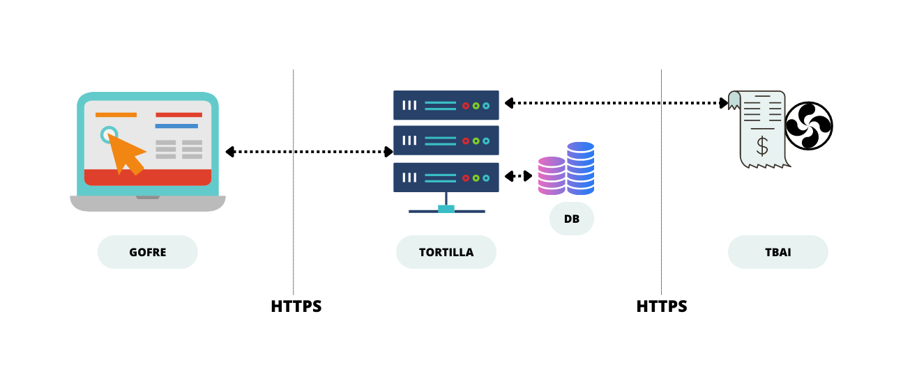
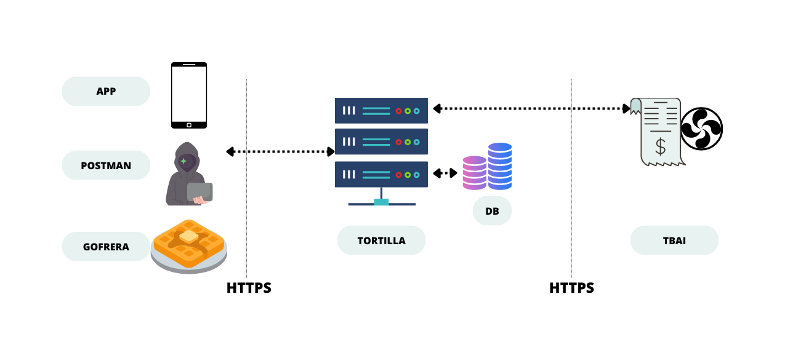
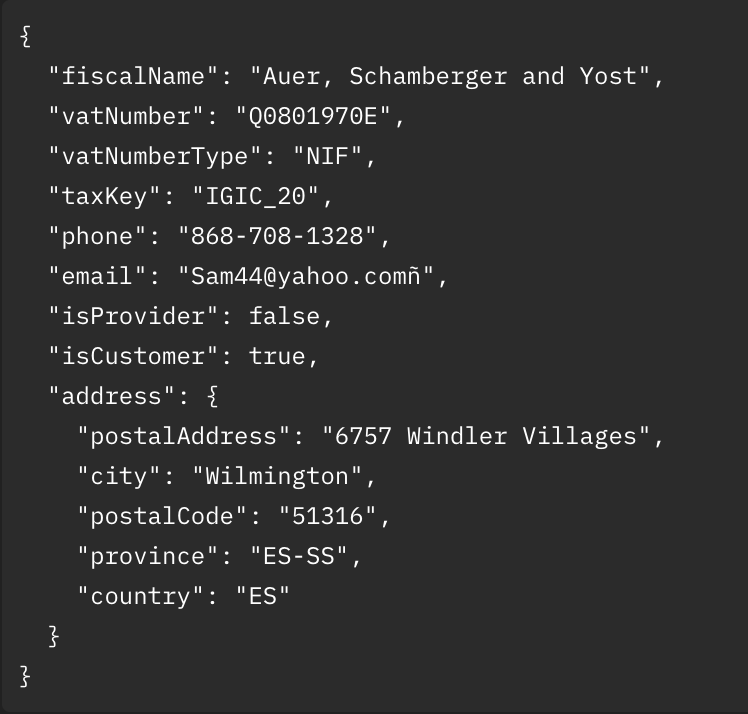
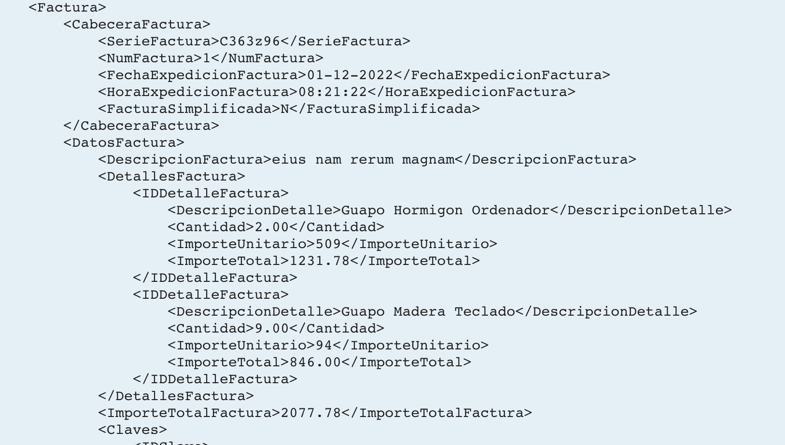

# LA API DE BILLIN

# VARIAS APPs SE PUEDEN COMUNCIAR CON UNA MISMA API

# SE COMUNICAN A TRAVÉS DE JSON o XML

# ⚠️⚠️⚠️⚠️⚠️ SIEMPRE DOCUMENTADAS ⚠️⚠️⚠️⚠️⚠️

- [MAILJET DOC](https://dev.mailjet.com/email/guides/send-api-V3/)
- [GOOGLE MAPS](https://developers.google.com/maps/documentation/javascript/markers)
- [BILLIN DOCS](https://tortilla.k-sta.billin.net/docs)

